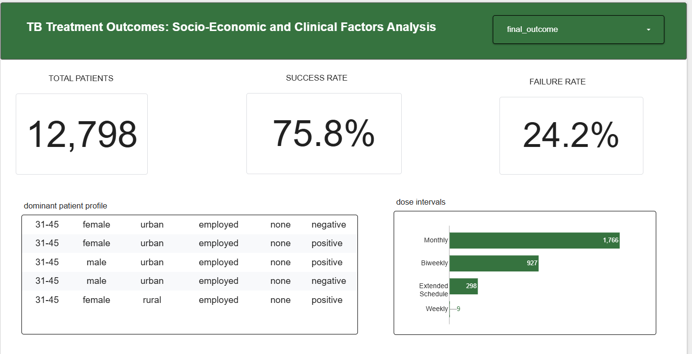
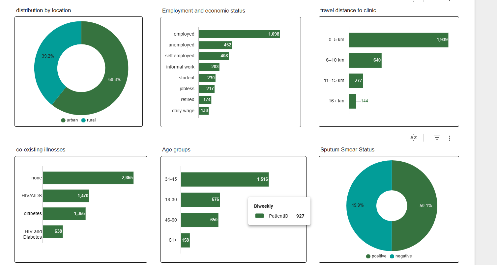

# tuberculosis treatment outcome analysis

## executive summary

Tuberculosis (TB) treatment success depends not only on medical factors but also on socio-economic conditions, patient behavior, and access to healthcare services.

This project analyzes integrated TB patient data to identify the key drivers of treatment success, failure, and loss to follow-up (LTFU). By combining demographic, clinical, and medication adherence data, the analysis reveals how multiple factors interact to influence patient outcomes.

Key findings show that:
- Distance to healthcare facilities significantly affects treatment success
- Employment status is strongly linked to adherence and recovery
- Rural patients and younger adults (18–30 years) are at higher risk of treatment failure
- Patients with comorbidities such as HIV and diabetes experience poorer outcomes
- Medication adherence is a critical driver of treatment success

The insights generated from this analysis can help healthcare providers identify high-risk patients early and design targeted intervention strategies to improve TB treatment outcomes and reduce dropout rates.





## **Problem Statement**

Tuberculosis (TB) treatment is a long process that requires patients to take daily medication for 6 to 9 months. Successful treatment depends on patients consistently following their medication plan until completion. However, many patients discontinue treatment early or become lost to follow-up, which leads to poor health outcomes and increases the risk of disease transmission.

Healthcare systems collect valuable patient data, including demographics (age, gender, employment status), socio-economic factors (location, distance to clinic), clinical information (BMI, comorbidities, sputum test results), and treatment records. However, this data is often stored in separate tables and not analyzed together in a unified way.

As a result, it becomes difficult for healthcare providers to understand the combined influence of clinical conditions and socio-economic challenges on treatment outcomes. Without this integrated view, it is hard to identify which patients are most at risk of dropping out of treatment and why this happens.

This project addresses this gap by combining and analyzing patient, clinical, and treatment datasets to uncover the key factors associated with treatment success and failure. The goal is to identify patterns of patient vulnerability and support better decision-making in healthcare interventions. These insights can help improve patient follow-up strategies, target support services more effectively, and ultimately reduce treatment dropouts in TB programs.


---
## tech stack
**MySQL** – Data cleaning, transformation, joins, aggregation, and feature engineering  
- **Looker Studio** – Interactive dashboard creation and visualization

  ---
  ## dataset description

This project combines multiple healthcare datasets related to tuberculosis (TB) treatment:

- **Patients dataset** → demographic and socio-economic information (age, gender, employment, location)
- **Biomarkers dataset** → clinical indicators such as BMI, sputum smear results, and comorbidities
- **Medication logs** → daily treatment adherence records (dose tracking and missed doses)
- **Treatment outcomes dataset** → final patient status (success, failure, loss to follow-up)

All datasets were linked using a common key: `PatientID`, enabling a unified patient-level analytical view.
  


## Data Cleaning and Transformation

A consistent data cleaning and transformation process was applied across all TB-related datasets to improve data quality, standardize formats, and prepare the data for analysis.

### 1. Database and Table Creation

A database named `tb` was created to store all project tables.Columns were initially stored as flexible text types to preserve raw data before cleaning.

```sql
CREATE DATABASE tb;
USE tb;
```

Example of raw table creation (`biomarkers`):

```sql
CREATE TABLE biomarkers (
    BiomarkerID VARCHAR(50),
    PatientID VARCHAR(50),
    TestDate TEXT,
    SputumSmearResult TEXT,
    BMI TEXT,
    Comorbidities TEXT
);
```

---

### 2. Date Standardization

Some date columns contained multiple formats, such as:
 DD/MM/YYYY , MM/DD/YYYY, YYYY-MM-DD, month text formats  

These were converted into a standard SQL `DATE` format.

```sql
UPDATE treatment_outcome
SET TreatmentStartDate =
CASE
    WHEN TreatmentStartDate REGEXP '^(1[3-9]|2[0-9]|3[0-1])/[0-9]{2}/[0-9]{4}$'
    THEN STR_TO_DATE(TreatmentStartDate, '%d/%m/%Y')

    WHEN TreatmentStartDate REGEXP '^[0-9]{4}-[0-9]{2}-[0-9]{2}$'
    THEN STR_TO_DATE(TreatmentStartDate, '%Y-%m-%d')

    ELSE NULL
END;
```
---

### 3. Standardizing Text Values

Categorical variables had inconsistent spelling, abbreviations, and capitalization.### Why?
This ensured values like ' COMPLETE`, `Complete`,` completed.`are treated as one category.

Example:

```sql
UPDATE treatment_outcome
SET FinalStatus =
CASE 
    WHEN FinalStatus = 'Lost' THEN 'LTFU'
    WHEN FinalStatus = 'TreatmentFailed' THEN 'failed'
    WHEN FinalStatus = 'FAIL' THEN 'failed'
    WHEN FinalStatus = 'COMPLETE' THEN 'completed'
    WHEN FinalStatus = 'lost to follow-up' THEN 'LTFU'
    ELSE FinalStatus
END;
```

Lowercasing text:

```sql
UPDATE treatment_outcome
SET FinalStatus = LOWER(FinalStatus);
```

---

### 4. Handling Missing Values

Some categorical columns contained invalid entries, such as:
`'nan'`,blank values (`''`).These were replaced with valid categories.This improved data completeness and prevents missing-value issues during analysis.

Checking missing values:

```sql
SELECT EmploymentStatus, COUNT(*) AS count
FROM patients
GROUP BY EmploymentStatus;
```

Replacing invalid values:

```sql
UPDATE patients
SET EmploymentStatus =
CASE 
    WHEN EmploymentStatus = 'nan' THEN 'employed'
    WHEN EmploymentStatus = '' THEN 'employed'
    ELSE EmploymentStatus
END;
```
---

### 5. Removing Duplicate Records

Duplicate records were checked and removed. This ensured that repeated records do not bias results.

Checking duplicates:

```sql
SELECT OutcomeID, COUNT(*) AS count
FROM treatment_outcome
GROUP BY OutcomeID;
```

Creating a clean table:

```sql
CREATE TABLE treatment_outcome_clean AS
SELECT DISTINCT *
FROM treatment_outcome;
```
---

### 6. Converting Data Types

Some columns were stored as text but needed to be numeric for analysis.

Example:

```sql
ALTER TABLE patients
MODIFY Age INT;
```

---

### 7. Medication Log Aggregation

The medication log contained daily records, so it was compressed into patient-level summary statistics.

```sql
CREATE TABLE combined_medication AS 
SELECT 
    PatientID,
    COUNT(LogID) AS Total_Scheduled_Doses,
    SUM(CASE WHEN DoseMissed = 1 THEN 1 ELSE 0 END) AS Total_Missed_Doses,

    MIN(DateScheduled2) AS Treatment_Start_Date,
    MAX(DateScheduled2) AS Last_Tracked_Date

FROM medication_log_clean
GROUP BY PatientID;
```
---

### 8. Joining All Tables

All cleaned datasets were combined into one analytical table using `PatientID`.
This created one unified dataset for complete patient analysis.


```sql
CREATE TABLE joined AS
SELECT 
    p.PatientID,
    p.Age,
    p.Gender,
    p.LocationType,
    p.EmploymentStatus,
    p.Distance_km,

    b.BMI AS Baseline_BMI,
    b.Comorbidities,
    b.SputumSmearResult AS Initial_Smear_Result,

    m.Total_Scheduled_Doses,
    m.Total_Missed_Doses,
    m.Adherence_Rate,

    o.FinalStatus AS Final_Treatment_Outcome

FROM patients_clean p

LEFT JOIN biomarkers_clean b 
    ON p.PatientID = b.PatientID

LEFT JOIN combined_medication m 
    ON p.PatientID = m.PatientID

LEFT JOIN treatment_outcome_clean o 
    ON p.PatientID = o.PatientID;
```
---

### 9. Feature Engineering

Continuous variables were grouped into categories for easier analysis.

Example: Distance grouping

```sql
UPDATE joined
SET Distance_Group =
CASE
    WHEN Distance_km BETWEEN 0 AND 5 THEN '0–5 km'
    WHEN Distance_km BETWEEN 6 AND 10 THEN '6–10 km'
    WHEN Distance_km BETWEEN 11 AND 15 THEN '11–15 km'
    ELSE '16+ km'
END;
```
---
            

## Exploratory Data Analysis (EDA)

After cleaning and integrating all datasets into the `joined` table, several analytical questions were explored to understand how socio-economic, clinical, and behavioral factors influence TB treatment outcomes.

The main objective of this analysis is to identify patterns associated with:
- Treatment success  
- Treatment failure 

---

### 1. Employment Status vs Treatment Outcome
Insight: Employment status is strongly associated with treatment outcomes. Patients with stable employment have higher treatment completion rates, while informal or unemployed groups show higher failure rates.

```sql
SELECT EmploymentStatus, Final_Treatment_Outcome,
ROUND(COUNT(*) * 100.0 / (SELECT COUNT(*) FROM joined), 2) AS percentage
FROM joined
GROUP BY EmploymentStatus, Final_Treatment_Outcome;
```

### results


---

### 2. Location Type (Urban vs Rural)
Insight: Urban patients achieve better treatment outcomes than rural patients, suggesting that access to healthcare services and infrastructure plays a key role in treatment success.

```sql
SELECT LocationType, Final_Treatment_Outcome,
ROUND(COUNT(*) * 100.0 / (SELECT COUNT(*) FROM joined), 2) AS percentage
FROM joined
GROUP BY LocationType, Final_Treatment_Outcome;
```

### results


---

### 3. Distance to Clinic vs Treatment Outcome
Insight: Distance to healthcare facilities is a major factor influencing treatment success. Patients living within 0–5 km show significantly higher success rates, while those beyond 10 km experience increased failure risk.
```sql
SELECT Distance_Group, Final_Treatment_Outcome,
COUNT(*) AS count,
ROUND(COUNT(*) * 100.0 / (SELECT COUNT(*) FROM joined), 2) AS percentage
FROM joined
GROUP BY Distance_Group, Final_Treatment_Outcome;
```

### results


---

### 4. Age Distribution Analysis
Insight: Young adults (18–30 years) show a higher proportion of treatment failure compared to other age groups, indicating this group may require additional adherence support.

```sql
SELECT Age_Group, Final_Treatment_Outcome,
COUNT(*) AS count,
ROUND(COUNT(*) * 100.0 / (SELECT COUNT(*) FROM joined), 2) AS percentage
FROM joined
GROUP BY Age_Group, Final_Treatment_Outcome;
```

### results


---

### 5. BMI vs Treatment Outcome
Insight: Baseline BMI does not show a strong variation across treatment outcomes, suggesting it is not a major predictor of TB treatment success in this dataset.


```sql
SELECT ROUND(AVG(Baseline_BMI), 2) AS avg_bmi,
Final_Treatment_Outcome
FROM joined
GROUP BY Final_Treatment_Outcome;
```

### results


---

### 6. Sputum Smear Results vs Outcome
insights: Even patients with positive initial smear results show high recovery rates, indicating that treatment adherence plays a critical role in overcoming initial disease severity.

```sql
SELECT Initial_Smear_Result, Final_Treatment_Outcome,
COUNT(*),
ROUND(COUNT(*) * 100.0 / (SELECT COUNT(*) FROM joined), 2) AS percentage
FROM joined
WHERE Initial_Smear_Result = 'positive'
GROUP BY Initial_Smear_Result, Final_Treatment_Outcome;
```

### results


---

### 7. Comorbidities vs Treatment Failure
Insight: Patients with comorbidities such as HIV and diabetes show higher failure rates, indicating increased clinical complexity and risk

```sql
SELECT Comorbidities, Final_Treatment_Outcome,
COUNT(*) AS count
FROM joined
WHERE Final_Treatment_Outcome = 'Failure'
GROUP BY Comorbidities, Final_Treatment_Outcome;
```

### results


---

### 8. High-Risk Socioeconomic Combination (Failure Cases)
Insight: Failure cases are often associated with a combination of socio-economic and accessibility challenges, highlighting the importance of multi-factor risk assessment.

```sql
SELECT LocationType, EmploymentStatus, Distance_Group,
Final_Treatment_Outcome, COUNT(*) AS count
FROM joined
WHERE Final_Treatment_Outcome = 'Failure'
GROUP BY LocationType, EmploymentStatus, Distance_Group, Final_Treatment_Outcome
ORDER BY count DESC;
```

### results


## dashboard 
An interactive dashboard was developed using Looker Studio to visualize key patterns in tuberculosis treatment outcomes. It allows healthcare stakeholders to explore relationships between variables and identify high-risk patient groups more efficiently than static analysis alone.
[view dashboard](https://datastudio.google.com/reporting/1ca5e04d-71f4-41c9-9784-5a918050825d)

## recommendations
- introduce mobile health clinics to deliver medicine directly to patients who live more than 6 km away from the nearest clinic.
- Implement home-based medication delivery programs for accessible medicine
- increase follow-up frequency in the high-risk group
- Combine TB, HIV, and diabetes care into a single appointment so patients do not have to make multiple clinic trips.


