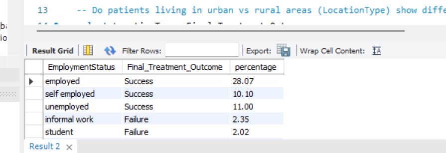
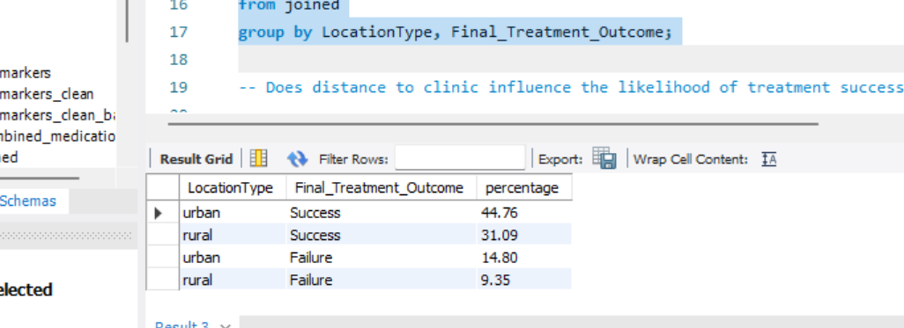
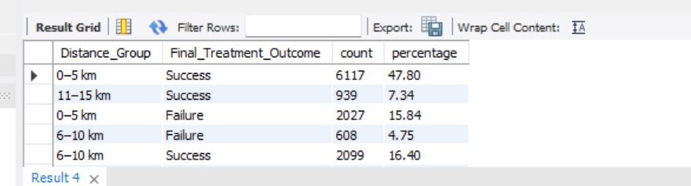
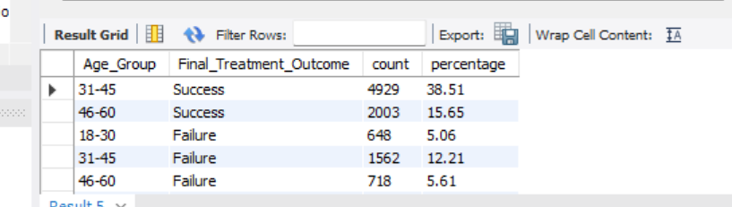
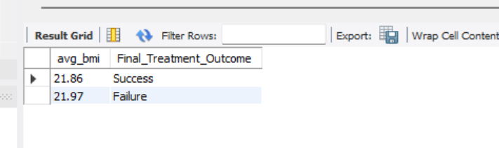
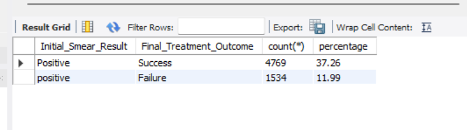
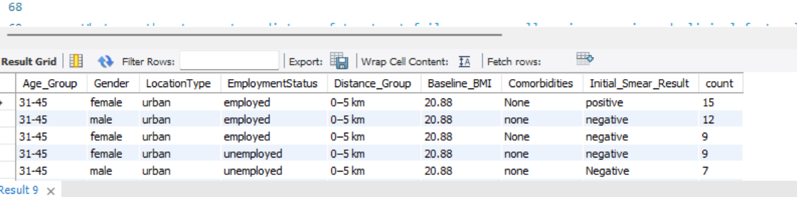

# project_3

## problem statement
## **Problem Statement**

Tuberculosis (TB) treatment is a long process that requires patients to take daily medication for 6 to 9 months. Successful treatment depends on patients consistently following their medication plan until completion. However, many patients discontinue treatment early or become lost to follow-up, which leads to poor health outcomes and increases the risk of disease transmission.

Healthcare systems collect valuable patient data, including demographics (age, gender, employment status), socio-economic factors (location, distance to clinic), clinical information (BMI, comorbidities, sputum test results), and treatment records. However, this data is often stored in separate tables and not analyzed together in a unified way.

As a result, it becomes difficult for healthcare providers to understand the combined influence of clinical conditions and socio-economic challenges on treatment outcomes. Without this integrated view, it is hard to identify which patients are most at risk of dropping out of treatment and why this happens.

This project addresses this gap by combining and analyzing patient, clinical, and treatment datasets to uncover the key factors associated with treatment success and failure. The goal is to identify patterns of patient vulnerability and support better decision-making in healthcare interventions. These insights can help improve patient follow-up strategies, target support services more effectively, and ultimately reduce treatment dropouts in TB programs.


# Data Cleaning and Transformation

## Overview
A consistent data cleaning and transformation process was applied across all TB-related datasets to improve data quality, standardize formats, and prepare the data for analysis. Since the data came from different sources (patients, biomarkers, medication logs, and treatment outcomes), cleaning was necessary before combining the tables using `PatientID`.

The cleaning process focused on:

- Handling inconsistent date formats  
- Standardizing text values  
- Handling missing or invalid values  
- Removing duplicate records  
- Converting columns to proper data types  
- Creating new grouped variables for analysis  
- Aggregating and joining datasets into one analytical table  

---

## 1. Database and Table Creation

A database named `tb` was created to store all project tables.

```sql
CREATE DATABASE tb;
USE tb;
```

Example of raw table creation (`biomarkers`):

```sql
CREATE TABLE biomarkers (
    BiomarkerID VARCHAR(50),
    PatientID VARCHAR(50),
    TestDate TEXT,
    SputumSmearResult TEXT,
    BMI TEXT,
    Comorbidities TEXT
);
```

### Why?
Columns were initially stored as flexible text types to preserve raw data before cleaning.

---

## 2. Date Standardization

Some date columns contained multiple formats such as:

- DD/MM/YYYY  
- MM/DD/YYYY  
- YYYY-MM-DD  
- Month text formats  

These were converted into a standard SQL `DATE` format.

```sql
UPDATE treatment_outcome
SET TreatmentStartDate =
CASE
    WHEN TreatmentStartDate REGEXP '^(1[3-9]|2[0-9]|3[0-1])/[0-9]{2}/[0-9]{4}$'
    THEN STR_TO_DATE(TreatmentStartDate, '%d/%m/%Y')

    WHEN TreatmentStartDate REGEXP '^[0-9]{4}-[0-9]{2}-[0-9]{2}$'
    THEN STR_TO_DATE(TreatmentStartDate, '%Y-%m-%d')

    ELSE NULL
END;
```

### Why?
This ensures date consistency and enables time-based analysis.

> The same date cleaning process was applied to other date columns where needed.

---

## 3. Standardizing Text Values

Categorical variables had inconsistent spelling, abbreviations, and capitalization.

Example:

```sql
UPDATE treatment_outcome
SET FinalStatus =
CASE 
    WHEN FinalStatus = 'Lost' THEN 'LTFU'
    WHEN FinalStatus = 'TreatmentFailed' THEN 'failed'
    WHEN FinalStatus = 'FAIL' THEN 'failed'
    WHEN FinalStatus = 'COMPLETE' THEN 'completed'
    WHEN FinalStatus = 'lost to follow-up' THEN 'LTFU'
    ELSE FinalStatus
END;
```

Lowercasing text:

```sql
UPDATE treatment_outcome
SET FinalStatus = LOWER(FinalStatus);
```

### Why?
This ensures values like:

- `COMPLETE`
- `Complete`
- `completed`

are treated as one category.

---

## 4. Handling Missing Values

Some categorical columns contained invalid entries such as:

- `'nan'`
- blank values (`''`)

These were replaced with valid categories.

Checking missing values:

```sql
SELECT EmploymentStatus, COUNT(*) AS count
FROM patients
GROUP BY EmploymentStatus;
```

Replacing invalid values:

```sql
UPDATE patients
SET EmploymentStatus =
CASE 
    WHEN EmploymentStatus = 'nan' THEN 'employed'
    WHEN EmploymentStatus = '' THEN 'employed'
    ELSE EmploymentStatus
END;
```

### Why?
This improves data completeness and prevents missing-value issues during analysis.

---

## 5. Removing Duplicate Records

Duplicate records were checked and removed.

Checking duplicates:

```sql
SELECT OutcomeID, COUNT(*) AS count
FROM treatment_outcome
GROUP BY OutcomeID;
```

Creating a clean table:

```sql
CREATE TABLE treatment_outcome_clean AS
SELECT DISTINCT *
FROM treatment_outcome;
```

### Why?
This ensures that repeated records do not bias results.

---

## 6. Converting Data Types

Some columns were stored as text but needed to be numeric for analysis.

Example:

```sql
ALTER TABLE patients
MODIFY Age INT;
```

### Why?
Numeric columns are required for calculations such as averages, grouping, and filtering.

> Similar datatype conversions were applied to other columns where necessary.

---

## 7. Medication Log Aggregation

The medication log contained daily records, so it was compressed into patient-level summary statistics.

```sql
CREATE TABLE combined_medication AS 
SELECT 
    PatientID,
    COUNT(LogID) AS Total_Scheduled_Doses,
    SUM(CASE WHEN DoseMissed = 1 THEN 1 ELSE 0 END) AS Total_Missed_Doses,

    ROUND(
        (COUNT(LogID) - SUM(CASE WHEN DoseMissed = 1 THEN 1 ELSE 0 END)) 
        * 100.0 / COUNT(LogID), 1
    ) AS Adherence_Rate,

    MIN(DateScheduled2) AS Treatment_Start_Date,
    MAX(DateScheduled2) AS Last_Tracked_Date

FROM medication_log_clean
GROUP BY PatientID;
```

### Why?
This transformed daily medication records into patient-level adherence indicators.

---

## 8. Joining All Tables

All cleaned datasets were combined into one analytical table using `PatientID`.

```sql
CREATE TABLE joined AS
SELECT 
    p.PatientID,
    p.Age,
    p.Gender,
    p.LocationType,
    p.EmploymentStatus,
    p.Distance_km,

    b.BMI AS Baseline_BMI,
    b.Comorbidities,
    b.SputumSmearResult AS Initial_Smear_Result,

    m.Total_Scheduled_Doses,
    m.Total_Missed_Doses,
    m.Adherence_Rate,

    o.FinalStatus AS Final_Treatment_Outcome

FROM patients_clean p

LEFT JOIN biomarkers_clean b 
    ON p.PatientID = b.PatientID

LEFT JOIN combined_medication m 
    ON p.PatientID = m.PatientID

LEFT JOIN treatment_outcome_clean o 
    ON p.PatientID = o.PatientID;
```

### Why?
This created one unified dataset for complete patient analysis.

---

## 9. Feature Engineering (Creating New Groups)

Continuous variables were grouped into categories for easier analysis.

Example: Distance grouping

```sql
UPDATE joined
SET Distance_Group =
CASE
    WHEN Distance_km BETWEEN 0 AND 5 THEN '0–5 km'
    WHEN Distance_km BETWEEN 6 AND 10 THEN '6–10 km'
    WHEN Distance_km BETWEEN 11 AND 15 THEN '11–15 km'
    ELSE '16+ km'
END;
```

### Why?
This makes it easier to compare treatment outcomes across distance ranges.

> Similar grouping was applied for variables such as age and treatment outcomes.

---

## Final Outcome

After cleaning and transformation:

- All tables were standardized  
- Missing and duplicate records were handled  
- Dates and text values were cleaned  
- Patient-level medication summaries were created  
- All datasets were joined into one final analytical table  
- New grouped variables were created to support deeper analysis  

This produced a clean and integrated dataset ready for analysis of factors affecting TB treatment outcomes.                 

# 📊 Exploratory Data Analysis (EDA)

After cleaning and integrating all datasets into the `joined` table, several analytical questions were explored to understand how socio-economic, clinical, and behavioral factors influence TB treatment outcomes.

The main objective of this analysis is to identify patterns associated with:
- Treatment success  
- Treatment failure  
- Loss to follow-up (LTFU)  

---

## 1. Employment Status vs Treatment Outcome
insight:Patients with stable jobs and steady income have much better treatment outcomes, whereas people with unpredictable income (informal work) or no income (students) struggle to cross the finish line.

```sql
SELECT EmploymentStatus, Final_Treatment_Outcome,
ROUND(COUNT(*) * 100.0 / (SELECT COUNT(*) FROM joined), 2) AS percentage
FROM joined
GROUP BY EmploymentStatus, Final_Treatment_Outcome;
```

### results


---

## 2. Location Type (Urban vs Rural)
Insight: Patients living in the city are significantly more likely to beat Tuberculosis than patients living in rural areas.

```sql
SELECT LocationType, Final_Treatment_Outcome,
ROUND(COUNT(*) * 100.0 / (SELECT COUNT(*) FROM joined), 2) AS percentage
FROM joined
GROUP BY LocationType, Final_Treatment_Outcome;
```

### results


---

## 3. Distance to Clinic vs Treatment Outcome
insight : Living close (0–5 km) yields the absolute highest volume of cured patients (47.80%). Once a patient lives further than 10 km away, their chances of completing treatment crash down to just 7.34%.
```sql
SELECT Distance_Group, Final_Treatment_Outcome,
COUNT(*) AS count,
ROUND(COUNT(*) * 100.0 / (SELECT COUNT(*) FROM joined), 2) AS percentage
FROM joined
GROUP BY Distance_Group, Final_Treatment_Outcome;
```

### results


---

## 4. Age Distribution Analysis
insight: The prime working-age group (31–45) represents the bulk of your clinic's caseload and requires heavy monitoring. Crucially, young adults (18–30) face acute challenges, making up a significant, standalone failure block.

```sql
SELECT Age_Group, Final_Treatment_Outcome,
COUNT(*) AS count,
ROUND(COUNT(*) * 100.0 / (SELECT COUNT(*) FROM joined), 2) AS percentage
FROM joined
GROUP BY Age_Group, Final_Treatment_Outcome;
```

### results


---

## 5. BMI vs Treatment Outcome
insight: The difference between success and failure is a tiny fraction of a BMI point (0.11). This proves that patients are starting treatment at roughly the same average, healthy weight. Baseline body weight does not determine whether a patient beats TB.


```sql
SELECT ROUND(AVG(Baseline_BMI), 2) AS avg_bmi,
Final_Treatment_Outcome
FROM joined
GROUP BY Final_Treatment_Outcome;
```

### results


---

## 6. Sputum Smear Results vs Outcome
insights: Patients who test highly positive at the very beginning are still highly curable! Over 3 times as many positive-testing patients succeed compared to those who fail.

```sql
SELECT Initial_Smear_Result, Final_Treatment_Outcome,
COUNT(*),
ROUND(COUNT(*) * 100.0 / (SELECT COUNT(*) FROM joined), 2) AS percentage
FROM joined
WHERE Initial_Smear_Result = 'positive'
GROUP BY Initial_Smear_Result, Final_Treatment_Outcome;
```

### results


---

## 7. Comorbidities vs Treatment Failure
insight: Managing TB alongside another heavy chronic disease significantly complicates recovery. Nearly 1,100 of your total failures happen to patients who are simultaneously fighting Diabetes, HIV, or both.

```sql
SELECT Comorbidities, Final_Treatment_Outcome,
COUNT(*) AS count
FROM joined
WHERE Final_Treatment_Outcome = 'Failure'
GROUP BY Comorbidities, Final_Treatment_Outcome;
```

### results


---

## 8. High-Risk Socioeconomic Combination (Failure Cases)
insight: the most typical patient walking through your clinic doors: a working-age city dweller who lives close by and starts treatment with a healthy body weight but a positive lab test.

```sql
SELECT LocationType, EmploymentStatus, Distance_Group,
Final_Treatment_Outcome, COUNT(*) AS count
FROM joined
WHERE Final_Treatment_Outcome = 'Failure'
GROUP BY LocationType, EmploymentStatus, Distance_Group, Final_Treatment_Outcome
ORDER BY count DESC;
```

### results

